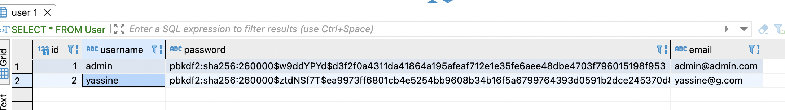
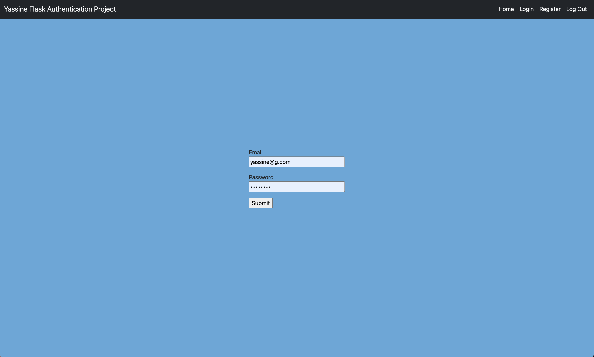
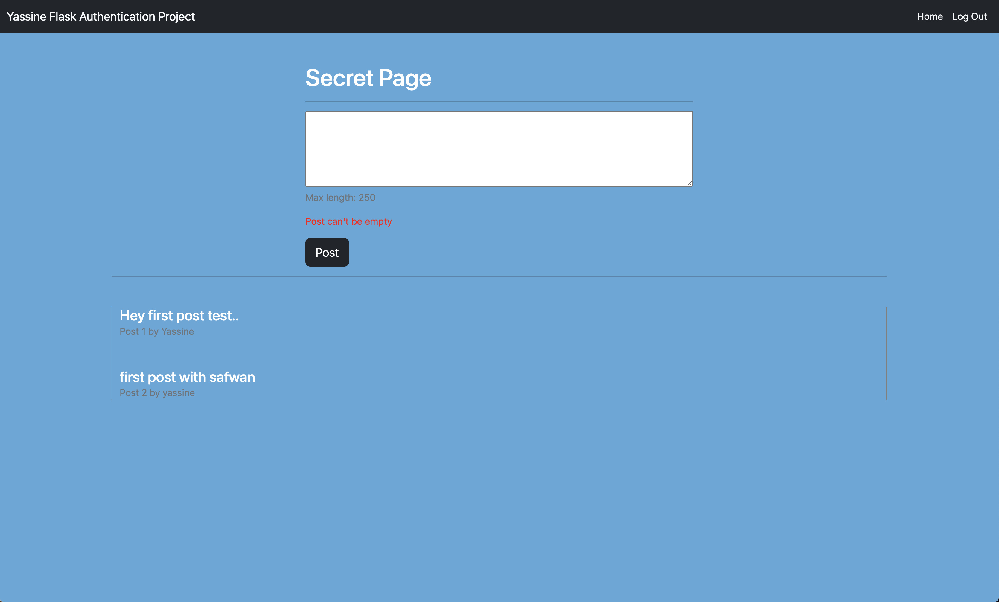

# Flask Authentication Project

My first project after completing my Python bootcamp, a social media style web app done with flask and sqlite. The goal of this project was to demonstrate my skills in python and sql, so i mainly focused on the backend. And created a secure web app where a user can register an account, store the user info in a database with password hashing, login, create posts, see other people's posts, and be able to logout. 


<details>
    <summary> <h1> Step by Step on how the backend work <h1>  </summary>

1. Register form (username, email, password): 
    - making sure the submited fields arent empty 
    - making sure the user entered a valid email
    - making sure the username is unique and a certain length
    - making sure the password is strong and over a certain lenght
    
    - hash and salt the password using sha256
    

 
> Then if everything checks out save the credentials to the db, let the user know they're register was successful then redirect the user to the login page. 

2. Login form (email, password): 
    - get ahold of the email and password
    - check if the email is in the database 
        - if yes check if the password hash match the on in the database
            - if yes log user in
    - once login hide the (register, and login) buttons and show the (logout and home) buttons
    


3. Create post
    - check post length 
    - finally add the post to the database 
    

</details>


# Techologies used 
``` Python3, Flask, flask_sqlalchemy, flask_login, flask_wtf, wtforms, Werkzeug, SQLite, HTML & CSS, Bootstrap, GIT ```

# Run locally
Will be deploying it soon when i finish with other project and my porfolio/personal site, in the meantime you can download and run it locally.
```
$ git clone https://github.com/fulanii/flask-auth-project.git
$ cd flask-auth-project
$ pip install -r requirements.txt
$ python run.py
```

# Future improvement & contributions
In the future thinking about adding the different changes bellow, and feel free to contribute too. 
- Edit button
- Delete button
- Add 2fa (and use some sort of email api to verify user email) 
- Make UI nicer


