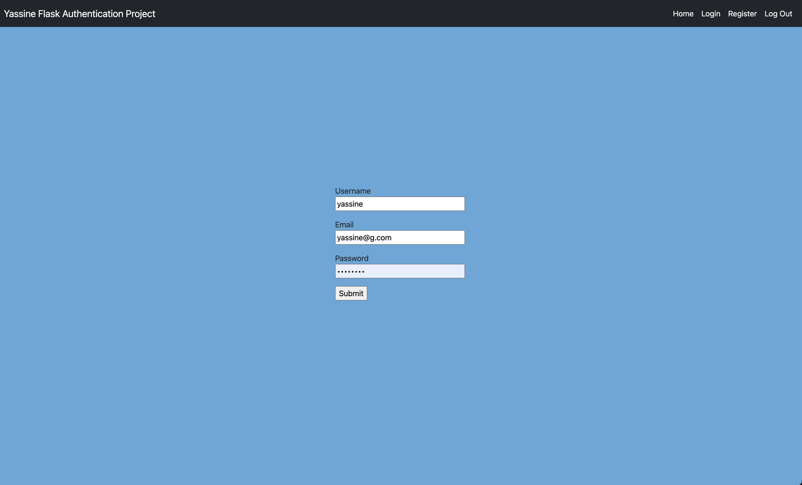

# Flask Authentication Project

This is my first project after i completed my Python bootcamp, a social media style web app done with flask and sqlite. The goal of this project was to demonstrate my skills in python and sql, so i mainly focused on the backend. And created a secure web app where a user can register an account, login, create posts see other people posts and be able to logout. 

<br>

# Step by Step on how the backend work
1. Register form (username, email, password): 
    - making sure the submited fields arent empty 
    - making sure the user entered a valid email
    - making sure the username is unique and a certain length
    - making sure the password is strong and over a certain lenght
    - hash and salt the password using sha256
 
 
> Then if everything checks out save the credentials to the db, let the user know they're register was successful then redirect the user to the login page. 

2. Login form (email, password): 
    - get ahold of the email and password
    - check if the email is in the database 
        - if yes check if the password hash match the on in the database
            - if yes log user in
    - once login
     hide the (register, and login) button and show the logout button


3. Create post

<br>

<details>
    <summary> Techologies used </summary>

1. Flask
    - flask_sqlalchemy
    - flask_login
    - flask_wtf
    - wtforms
    - Werkzeug

``` Python3, SQLite, HTML & CSS, Bootstrap, GIT ```
</details>

